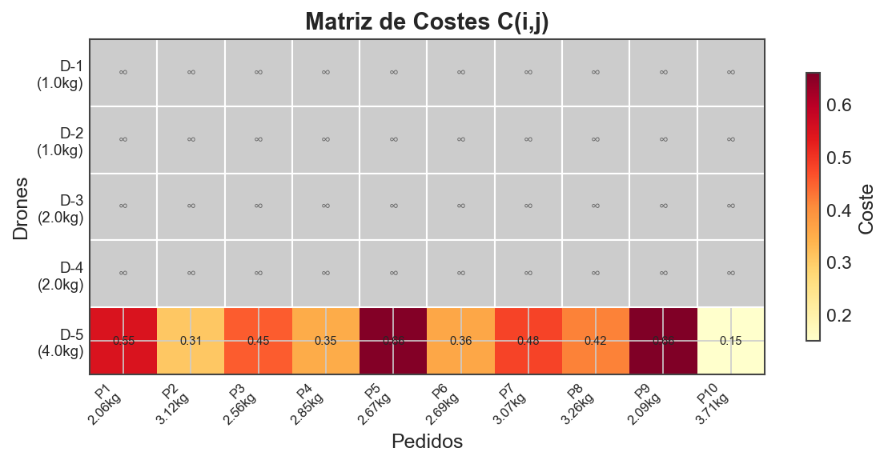
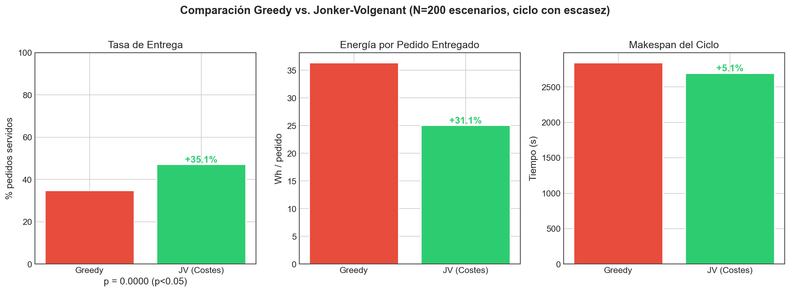
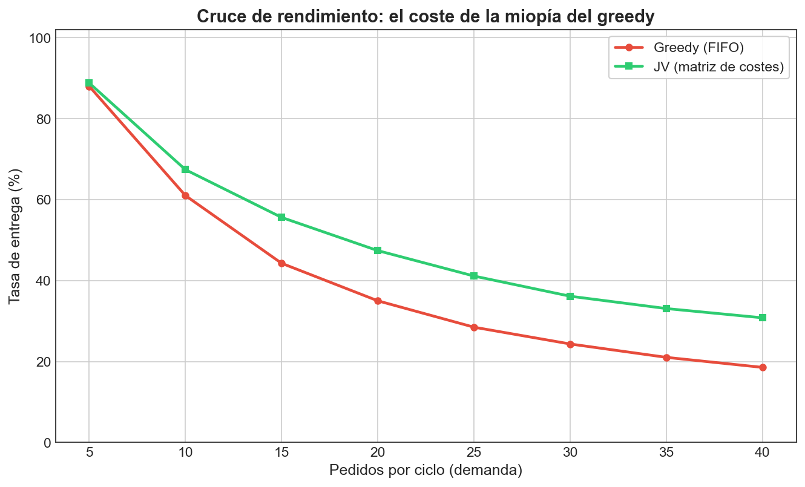
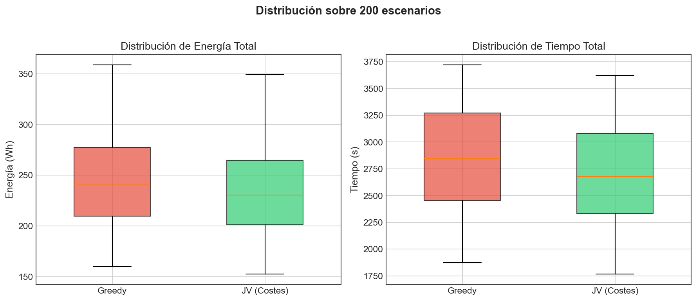

# Informe de simulación: asignación de pedidos en un enjambre de drones

Trabajo de Fin de Grado — Guillermo Galve Barranco (UPC)

Este documento resume la parte de simulación del proyecto: el problema que
modelo, la función de costes que propongo para asignar pedidos a drones, los dos
algoritmos que comparo, la metodología experimental y los resultados, con las
gráficas explicadas. Al final indico las librerías y el código usados y cómo
reproducir todo.

---

## 1. Problema y objetivo

Tengo una flota heterogénea de drones en un parking y una cola de pedidos, cada
uno con un peso y un destino en Castelldefels. Hay que decidir **qué dron entrega
qué pedido**. La decisión no es trivial porque los drones difieren en capacidad de
carga, autonomía y consumo, y porque cada pedido consume batería distinta según el
dron que lo haga.

El objetivo del estudio es comparar dos estrategias de asignación:

- una **voraz (greedy, FIFO)**, sencilla, que asigna cada pedido en orden de
  llegada al dron de menor coste en ese momento;
- una **asignación global óptima** sobre una matriz de costes, resuelta con el
  algoritmo de Jonker-Volgenant.

La hipótesis es que la asignación global aprovecha mejor la flota cuando la
capacidad escasea, que es justo el caso operativo interesante.

---

## 2. Modelo del sistema

### 2.1 Flota

Trabajo con tres categorías de dron. Los parámetros salen del modelo de energía
del proyecto (`simulacion/energy_model.py`):

| Categoría | Carga máx. (kg) | Batería (Wh) | Velocidad (m/s) | P. base (W) | P. carga (W/kg) |
|-----------|-----------------|--------------|-----------------|-------------|-----------------|
| Ligero    | 1.0             | 148          | 8               | 140         | 30              |
| Medio     | 2.0             | 222          | 7               | 180         | 22              |
| Pesado    | 4.0             | 360          | 6               | 280         | 18              |

La flota por defecto son 5 drones: 2 ligeros, 2 medios y 1 pesado. Es deliberado:
el dron pesado es el único que puede con los paquetes más grandes, lo que crea un
recurso escaso por el que compiten los pedidos.

### 2.2 Modelo de energía

La energía de un tramo la modelo de forma lineal con el peso transportado:

```
E_tramo (Wh) = (P_base + P_carga · peso) · t
t (h) = distancia · 1000 / velocidad / 3600
```

Un viaje completo es ida (con carga) más vuelta (sin carga):

```
E_viaje = E_ida(peso) + E_vuelta(0)
```

Las distancias parking→cliente las calculo con la fórmula de Haversine sobre
coordenadas reales de Castelldefels (`simulacion/scenario_generator.py`). El
tiempo de recarga es `E_necesaria / P_cargador`.

---

## 3. Función de costes C(i,j)

El núcleo del trabajo es la función de costes que decide lo "bueno" que es asignar
el dron *i* al pedido *j* (`simulacion/cost_function.py`). Es una suma ponderada de
términos, cada uno normalizado a [0, 1]:

```
C(i,j) = w1·E_viaje + w2·penal_batería + w3·exceso_capacidad + w4·espera_recarga (+ w5·balanceo)
```

**Restricciones duras** (devuelven coste infinito → asignación inviable):

- el peso del pedido supera la carga máxima del dron;
- la energía del viaje supera la batería disponible dejando un 20 % de reserva.

**Términos del coste:**

- **w1 — Energía de viaje.** Fracción de la batería del dron que consume el viaje.
  Penaliza los viajes caros en energía.
- **w2 — Equilibrio de batería.** Penaliza dejar al dron por debajo del 20 % tras
  el viaje; protege la autonomía de la flota.
- **w3 — Exceso de capacidad.** Penaliza usar un dron grande para un paquete
  pequeño (p. ej. el pesado para 0.5 kg), reservando los drones de más capacidad
  para los paquetes que de verdad los necesitan.
- **w4 — Espera por recarga.** Penaliza dejar al dron con tan poca batería que
  tendría que recargar antes de la siguiente misión.
- **w5 — Balanceo de carga** (opcional). Penaliza cargar de trabajo a un dron que
  ya acumula mucho tiempo, para repartir y reducir el makespan.

Los pesos `w1..w4` controlan el comportamiento. Con todos a 1 el sistema equilibra
los cuatro criterios; subiendo uno se prioriza ese objetivo. Estos pesos **no son
arbitrarios**: pueden ajustarse con los optimizadores de la sección 6.

La asignación global construye la **matriz de costes** N_drones × M_pedidos con
esta función y la resuelve de forma óptima. La siguiente figura muestra una matriz
de ejemplo (gris = inviable):



---

## 4. Algoritmos comparados

### 4.1 Greedy (FIFO) — `simulacion/greedy_assigner.py`

Procesa los pedidos en orden de llegada. Para cada uno calcula el coste con todos
los drones y lo asigna al de menor coste viable, actualizando su batería. Es
rápido y simple, pero **miope**: una buena decisión local temprana puede dejar sin
recurso a un pedido posterior (por ejemplo, gastar el dron pesado en un paquete
ligero que llegó antes).

### 4.2 Jonker-Volgenant (matriz de costes) — `simulacion/cost_matrix_assigner.py`

Resuelve el problema de asignación de coste mínimo sobre la matriz completa con
`scipy.optimize.linear_sum_assignment` (implementación del algoritmo de
Jonker-Volgenant, coste O(n³)). Como suele haber más pedidos que drones, trabaja
por rondas: asigna una tanda óptima, actualiza baterías y repite. Al ver todos los
pedidos a la vez, **evita las trampas de la decisión voraz**.

---

## 5. Metodología experimental

El punto clave del experimento es **en qué régimen se compara**. Si la flota tiene
capacidad de sobra, cualquier estrategia entrega todos los pedidos y las dos
empatan; eso no distingue los algoritmos.

Por eso comparo en una **oleada de despacho con escasez**: un único ciclo de
reparto, sin recarga intermedia, con baterías limitadas (50–90 %) y paquetes
pesados (2–4 kg), de modo que la demanda supera la capacidad disponible. Es un
escenario operativo realista (una tanda de pedidos con la flota tal como está) y es
donde la asignación importa de verdad.

- **Escenarios:** 200, generados con semilla fija (reproducibles).
- **Métricas** (las que distinguen a los algoritmos bajo escasez):
  - **tasa de entrega** (pedidos servidos / pedidos del ciclo),
  - **energía por pedido entregado** (Wh/pedido), justa cuando cada algoritmo
    entrega un número distinto,
  - **makespan** del ciclo.
- **Significancia:** test *t* pareado (cada escenario se ejecuta con los dos
  algoritmos), `scipy.stats.ttest_rel`.

---

## 6. Resultados

Resultados sobre 200 escenarios (`results/comparison/summary.txt`):

| Métrica | Greedy (FIFO) | JV (matriz de costes) | Mejora | p-valor |
|---------|---------------|------------------------|--------|---------|
| Tasa de entrega | 34.9 % (7.0 ped.) | 47.2 % (9.4 ped.) | **+35.1 %** | < 0.0001 |
| Energía por entrega | 36.38 Wh | 25.07 Wh | **−31.1 %** | — |
| Makespan | 2843.6 s | 2697.5 s | +5.1 % | < 0.0001 |

La asignación global **entrega un 35 % más de pedidos consumiendo un 31 % menos de
energía por entrega**, con diferencias estadísticamente significativas.

### 6.1 Comparación de las tres métricas



Las tres barras resumen la tabla: JV (verde) entrega más, gasta menos por entrega y
termina antes que el greedy (rojo). Bajo el primer panel aparece el p-valor del
test pareado.

### 6.2 Curva de cruce (la figura clave)



Esta gráfica responde a la pregunta *"¿cuándo merece la pena la asignación
sofisticada?"*. En el eje X aumento la demanda (pedidos por ciclo) con la flota
fija; en el Y, la tasa de entrega de cada algoritmo.

- Con **poca demanda** (izquierda) ambos entregan casi todo: sobra capacidad y el
  greedy basta.
- A medida que **la demanda supera la capacidad**, el greedy se degrada antes y la
  brecha a favor de JV se ensancha.

Es decir, la ventaja de la asignación global no es un número aislado, sino un
comportamiento: aparece justo cuando el sistema entra en contención. Esto es más
honesto y más informativo que un único caso favorable.

### 6.3 Dispersión sobre los escenarios



Los diagramas de caja muestran que las diferencias no dependen de un escenario
afortunado: se mantienen sobre la distribución de los 200 casos.

---

## 7. Optimización de los pesos de la función de costes

Los pesos `w1..w4` se pueden ajustar para un objetivo concreto (minimizar energía o
makespan). He implementado varios optimizadores que buscan los mejores pesos sobre
un conjunto de escenarios (`simulacion/optimizer_*.py`), accesibles desde la misma
CLI:

- **Algoritmo Genético** y **Monte Carlo** (implementación propia): búsqueda de los
  pesos que minimizan el objetivo.
- **NSGA-II** (multiobjetivo): frente de Pareto energía–tiempo.
- **Optimización bayesiana** y un **baseline MILP** exacto de makespan, como
  referencias.

Esto deja la función de costes como una pieza ajustable, no como una heurística
fija: el mismo marco permite estudiar qué término gobierna cada métrica.

---

## 8. Librerías y organización del código

Todo el código de simulación está en Python y vive en `simulacion/` (la lógica) y
`experiments/` (los puntos de entrada). Librerías:

| Uso | Librería |
|-----|----------|
| Cálculo numérico y matrices | `numpy` |
| Asignación óptima (Jonker-Volgenant) | `scipy.optimize.linear_sum_assignment` |
| Test estadístico (t pareado) | `scipy.stats.ttest_rel` |
| Gráficas | `matplotlib` |
| NSGA-II (opcional) | `pymoo` |
| Optimización bayesiana (opcional) | `scikit-optimize` |
| Baseline MILP (opcional) | `PuLP` |

Mapa del código:

| Fichero | Contenido |
|---------|-----------|
| `simulacion/energy_model.py` | Modelo de energía, autonomía y recarga; catálogo de drones. |
| `simulacion/cost_function.py` | Función de costes C(i,j), restricciones duras y matriz de costes. |
| `simulacion/greedy_assigner.py` | Asignación voraz (FIFO). |
| `simulacion/cost_matrix_assigner.py` | Asignación global con Jonker-Volgenant por rondas. |
| `simulacion/scenario_generator.py` | Generación reproducible de escenarios (Castelldefels). |
| `simulacion/simulator.py` | Motor de simulación; ciclo único de despacho para la comparación. |
| `simulacion/metrics.py` | Métricas comparativas y test estadístico. |
| `simulacion/visualization.py` | Todas las gráficas de este informe. |
| `simulacion/optimizer_*.py`, `milp_baseline.py` | Optimización de pesos y baseline. |
| `experiments/run.py` | CLI única: `compare`, `genetic`, `montecarlo`, `nsga2`, `bayes`, `milp`. |

---

## 9. Tráfico seguro del enjambre (línea en curso)

Cuando varios drones despegan en la misma oleada, hay que evitar conflictos en el
parking, en el hub común y en los tramos compartidos. El planteamiento es de
**deconflicción estratégica** (resolver antes de volar): corredores pre-aprobados,
separación por **capas de altitud**, **secuenciación de despegues** y **reservas
temporales de tramo**, con una capa reactiva mínima (hold) como contingencia. Es el
trabajo que continúo ahora y encaja con la arquitectura ya prevista (gestor de
espacio aéreo y tabla de segmentos de vuelo).

---

## 10. Cómo reproducirlo

**Simulación (Python 3.12):**

```bash
pip install -r requirements-dev.txt
python -m pytest -q                                   # 44 pruebas en verde
python -m experiments.run compare --n-scenarios 200 --seed 42
#   genera results/comparison/ (summary.txt, comparison.tex y las gráficas)
```

**Portal de cliente en la nube:** https://tfg-drones.onrender.com/
(alta de cliente con una dirección de Castelldefels y creación de un pedido; los
datos se guardan en Supabase). Para levantarlo en local:

```bash
pip install -r webapp/requirements.txt
uvicorn webapp.main:app --port 8080                   # http://localhost:8080/
```
