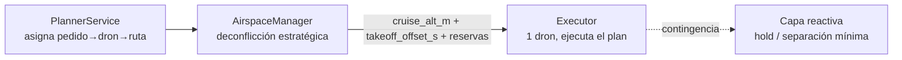

# 06 · Deconflicción y tráfico seguro del enjambre

> **TFG · ProyectoDrones_LOCAL · Documento de diseño**
> Continúa las decisiones de `00-OVERVIEW.md` (§4) y `03-ARCHITECTURE.md` (§6–§8).
> Este documento es **solo diseño**: no implementa código todavía.

---

## 1. Problema

Cuando el `PlannerService` asigna varios pedidos en el mismo ciclo, varios drones
despegan en una ventana corta desde uno o pocos parkings, atraviesan el **HUB**
común y recorren corredores que comparten tramos. Sin coordinación se producen
tres tipos de conflicto:

1. **Conflicto en parking/HUB**: dos drones ocupan el mismo punto a la vez al
   despegar o al cruzar el hub logístico.
2. **Conflicto en ruta**: dos corredores comparten un tramo y los drones
   coinciden en él en el mismo instante y a la misma altura.
3. **Conflicto en aterrizaje/retorno**: varios drones vuelven al parking a la vez.

La estrategia adoptada es **deconflicción estratégica** (resolver antes de volar,
plan A) con una **capa reactiva** mínima como contingencia (plan B). Es coherente
con el alcance del proyecto: DAA reactivo basado en sensores queda fuera
(`00-OVERVIEW.md`, "Fuera del alcance").



---

## 2. Deconflicción estratégica (plan A)

Cuatro mecanismos complementarios, ordenados de más simple a más fino.

### 2.1 Corredores pre-aprobados

`route_profiles.json` ya define los corredores aéreos: cada perfil tiene
`parkings`, `hub`, `destinations` y `routes`, y cada `route` lleva
`intermediates` (lista de waypoints `lat/lon/alt`). Es decir, **los drones no
vuelan en línea recta arbitraria**, sino por trayectorias pre-validadas
parking → hub → intermedios → destino → cliente. Esto reduce el espacio de
conflicto a los puntos donde los corredores se solapan (sobre todo el HUB y los
tramos compartidos).

El plan no inventa rutas: reutiliza `RouteService.build_mission(profile, route)`
(`servicios/route_service.py:63`), que ya devuelve la secuencia de waypoints con
altitud por tramo.

### 2.2 Capas de altitud

Mecanismo principal de separación en crucero. El `AirspaceManager`
(`03-ARCHITECTURE.md §7`) mantiene un conjunto de slots de altitud libres
(p.ej. `25, 30, 35, 40, 45 m`) y asigna uno a cada `Assignment` saliente por
**round-robin**, evitando que dos drones en vuelo compartan altura. El slot se
escribe en `assignments.cruise_alt_m` y se **libera** cuando el dron regresa al
parking (`AirspaceManager.release`).

Con esto, aunque dos corredores se crucen en planta, los drones pasan a alturas
distintas: el conflicto 2D se resuelve verticalmente. El número de slots fija el
máximo de drones simultáneos en el aire antes de tener que recurrir a
secuenciación temporal.

### 2.3 Slots / secuenciación de despegue

La separación vertical no basta en el parking y el HUB, donde todos los drones
convergen a baja altura. El `AirspaceManager` calcula un **`takeoff_offset_s`**
por asignación que escalona los despegues:

- Dos drones del mismo parking no despegan en una ventana ≤ `TAKEOFF_GAP_S` (10 s).
- Un dron no entra al HUB mientras otro lo está cruzando (se comparan las ETAs
  estimadas con `energy_model.estimate_duration_s`).

El offset se persiste en `assignments.takeoff_offset_s` y el `Executor` lo
respeta antes de armar y despegar. El escalonado convierte un pico de tráfico
simultáneo en una secuencia ordenada que vacía el HUB entre paso y paso.

### 2.4 Reservas de tramo (espacio-temporal)

Refinamiento para corredores que comparten tramos fuera del HUB. Cada
`Assignment` se descompone en tramos (los segmentos entre waypoints
consecutivos de su misión). Para cada tramo se calcula una **ventana temporal de
ocupación** `[t_entrada, t_salida]` a partir del `takeoff_offset_s`, la velocidad
del perfil y la longitud del tramo. La reserva se guarda como filas en
`flight_segments` (tabla prevista en `03-ARCHITECTURE.md §4.1`):

```
flight_segments(assignment_id, seg_index, lat_a, lon_a, lat_b, lon_b,
                alt_m, t_enter_s, t_exit_s)
```

Antes de confirmar un plan, el `AirspaceManager` comprueba que dos drones a la
**misma altura** no reserven el **mismo tramo** con ventanas temporales
solapadas. Si hay solape, ajusta el `takeoff_offset_s` del segundo dron (o lo
sube de slot de altitud) hasta eliminarlo. Es la capa más fina y solo se activa
cuando las capas de altitud y el escalonado no son suficientes (muchos drones,
pocos corredores).

### Resumen de prioridad

| Mecanismo | Resuelve | Coste | Cuándo |
|-----------|----------|-------|--------|
| Corredores pre-aprobados | rutas arbitrarias | nulo (ya existe) | siempre |
| Capas de altitud | cruce en crucero | bajo | siempre |
| Secuenciación de despegue | parking + HUB | bajo | siempre |
| Reservas de tramo | tramos compartidos | medio | alta densidad |

---

## 3. Capa reactiva (plan B)

Contingencia para lo que la planificación estratégica no puede prever
(deriva de posición, retrasos, recálculos en caliente). **No** es DAA basado en
sensores; es una salvaguarda geométrica simple sobre la telemetría que ya
publican los drones:

- **Separación mínima**: si dos drones quedan a menos de una distancia de
  seguridad horizontal y en el mismo slot de altitud, el de menor prioridad
  (p.ej. el que lleva menos recorrido) entra en **hold**.
- **Maniobra de espera (hold)**: el dron en conflicto mantiene posición a su
  altura hasta que el tramo queda libre, y luego reanuda la misión.

Queda **fuera del alcance de implementación** de esta iteración (coherente con
`00-OVERVIEW.md`): se documenta como diseño para que la memoria del TFG muestre
que el sistema tiene un plan B, pero la entrega se apoya en la deconflicción
estratégica, que es determinista, reproducible y defendible.

---

## 4. Encaje con la arquitectura existente

- **Persistencia**: `assignments.cruise_alt_m`, `assignments.takeoff_offset_s`
  y la tabla `flight_segments` ya están previstas en `03-ARCHITECTURE.md §4.1`.
- **Servicios**: la lógica vive en `servicios/airspace_manager.py`
  (`§7`), invocado por `PlannerService.build_plan` tras resolver el CVRP y antes
  de devolver el `FlightPlan`. El `Executor` (`§8`) solo consume los campos ya
  resueltos (altura y offset), sin tomar decisiones de tráfico.
- **Datos**: no requiere nuevos corredores; se apoya en `route_profiles.json`.

---

## 5. Validación propuesta (futura)

- `tests/test_airspace_manager.py`: slots únicos por dron en vuelo, escalonado
  con separación ≥ `TAKEOFF_GAP_S`, liberación de slot al retornar, detección de
  solape de reservas de tramo a la misma altura.
- Escenario SITL con ≥ 3 drones y ≥ 5 pedidos: comprobar visualmente en el mapa
  que ningún par coincide en posición + altura simultáneamente.
